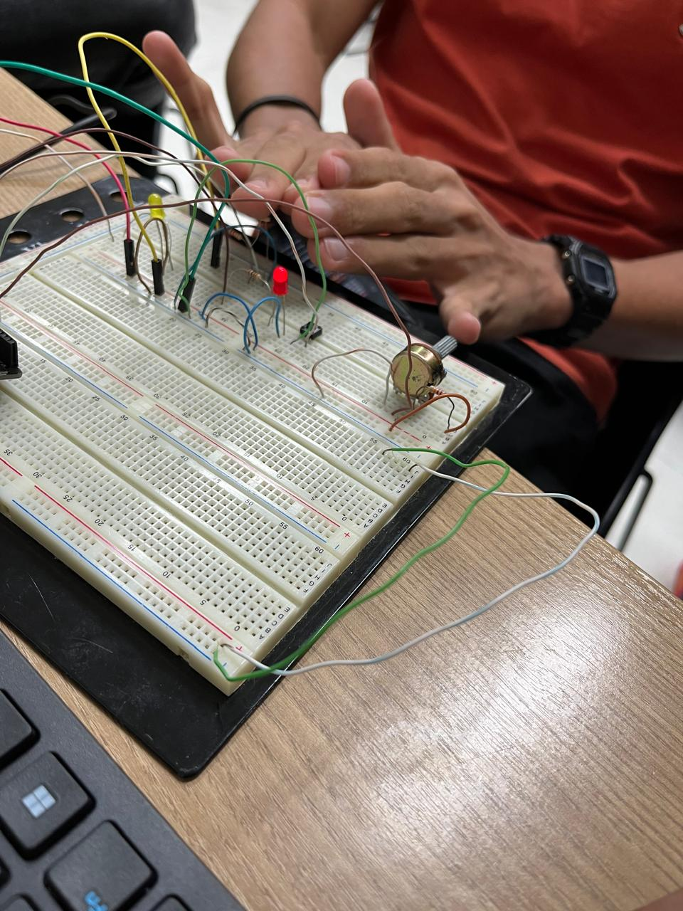
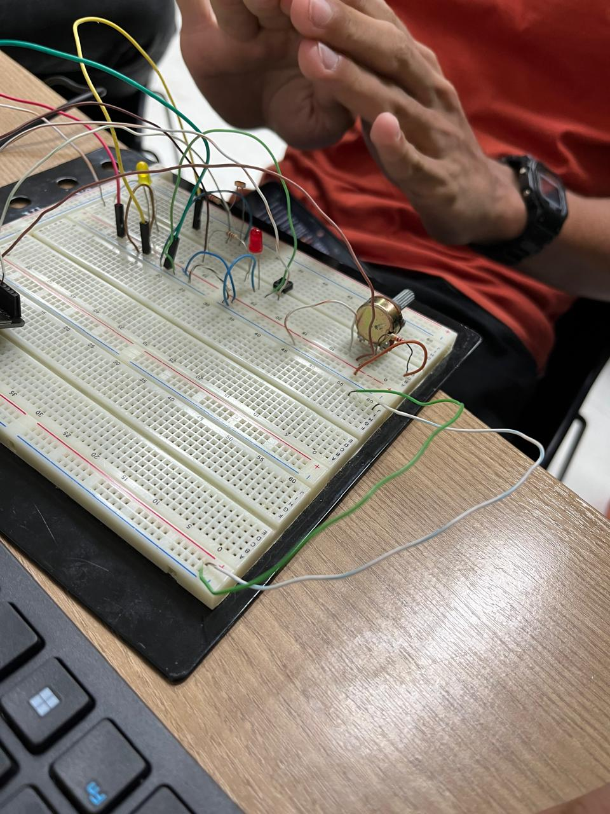
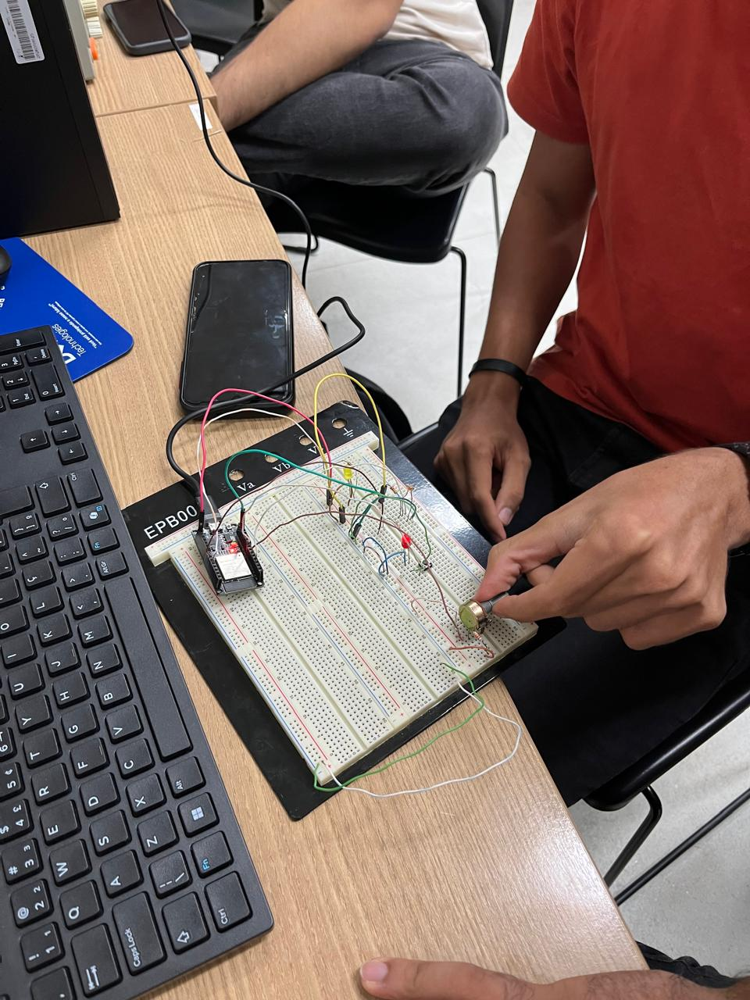

# Atividade Prática Potenciômetro/LDR com LEDs

## Registros fotográficos

### Led Aceso

### Led Apagado

### Potênciometro

## Código da atividade

[Abrir código do Arduino](./aula06.ino)

## Vídeo do circuito funcionando

